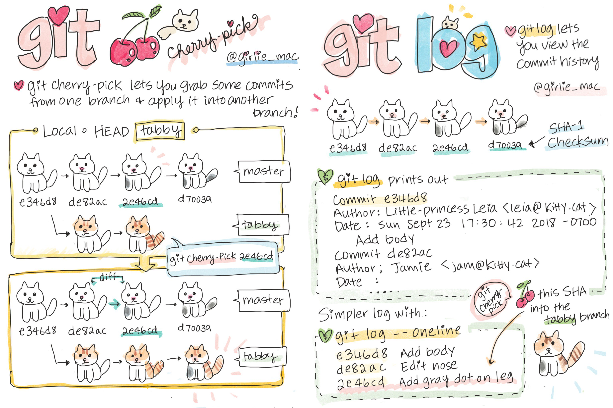
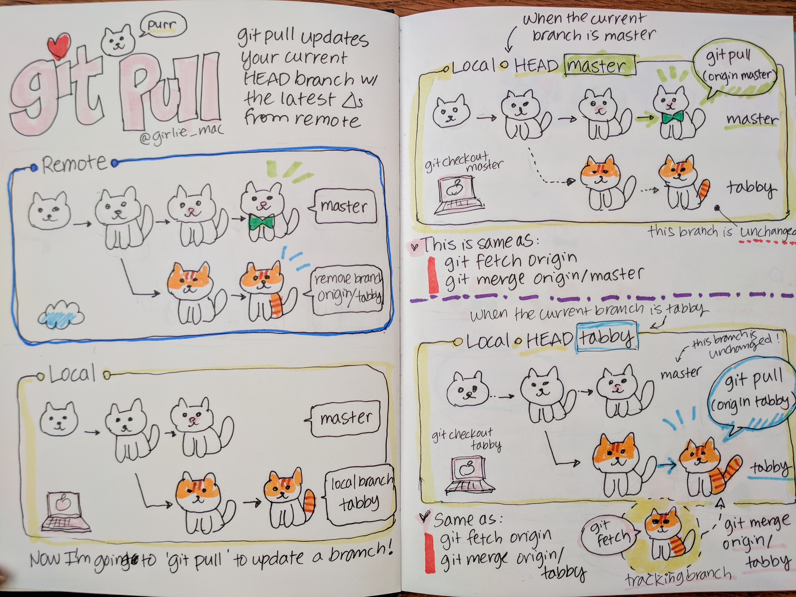
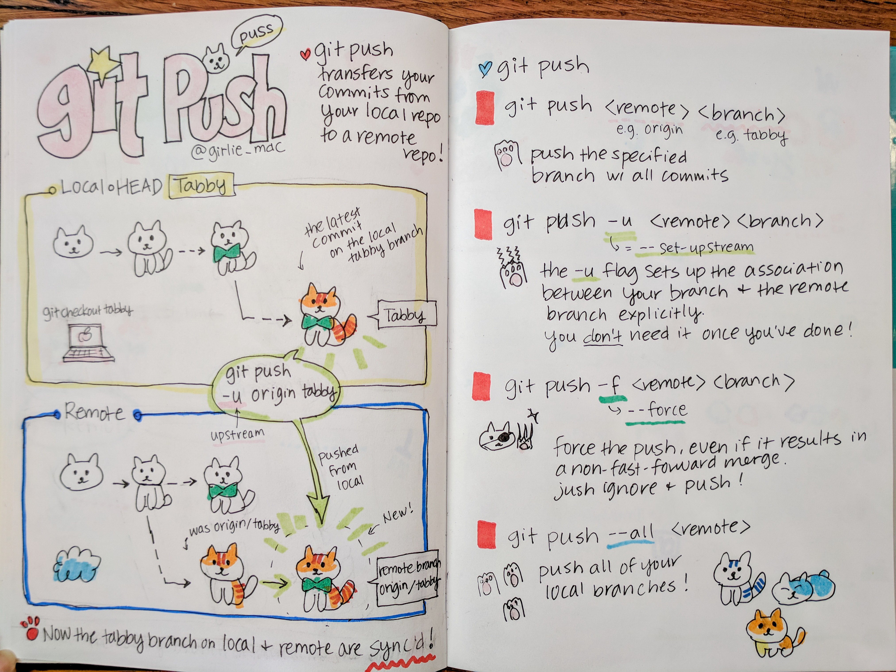
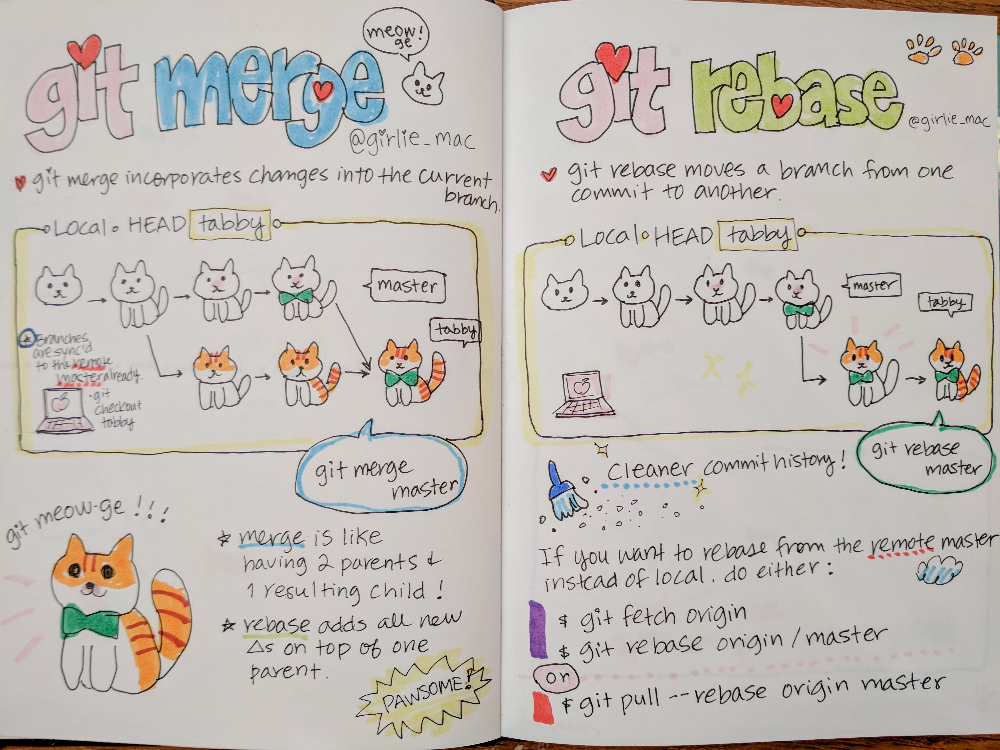

[back](./README.md)

### software

#### phpStorm

#### VS Code

#### git

```git push jedi master --force```

  
  
  
  

[mermaid](https://mermaid-js.github.io/)

```mermaid
gitGraph:
options
{
    "nodeSpacing": 75,
    "nodeRadius": 15
}
end
commit
branch master
commit
branch develop
checkout develop
commit
branch feature
checkout feature
commit
checkout master
branch hotfix
checkout hotfix
commit
commit
checkout develop
merge hotfix
commit
checkout master
merge develop
checkout feature
commit
checkout feature

```
